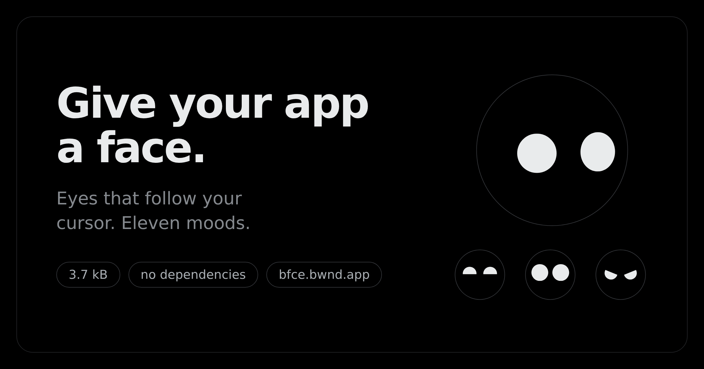
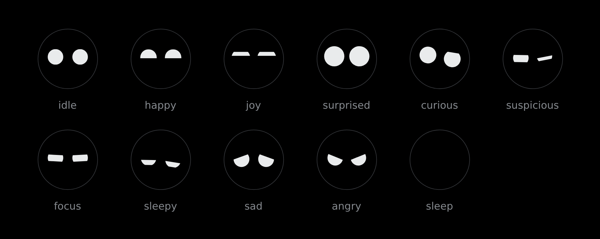
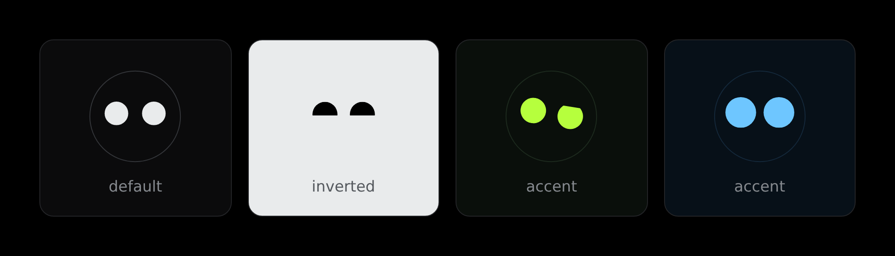
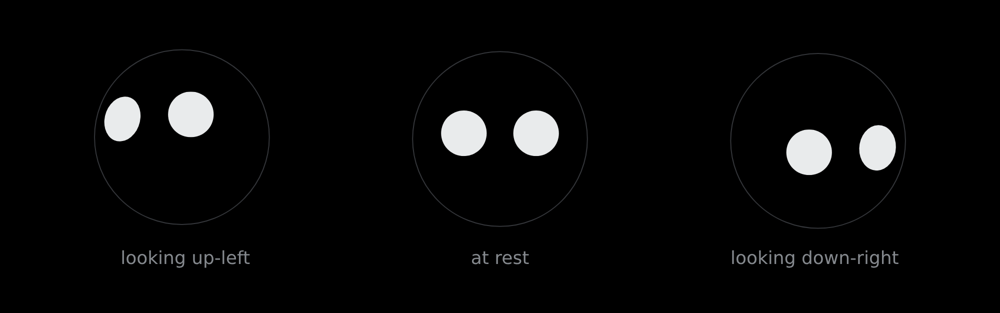

<div align="center">

# bfce

**A small, friendly face you can drop into a web page.**

It follows your cursor, blinks on its own, and glances around when you leave it
alone. Eleven moods, nine one-shot reactions, **3.7 kB gzipped**, no dependencies.

### [→ Try it live at bfce.bwnd.app](https://bfce.bwnd.app)



</div>

---

## Quick start

Nothing to install. The bundle is hosted with styles included, so this is the
whole integration:

```html
<div id="bot" style="width:160px;height:160px"></div>

<script type="module">
  import { createFace } from 'https://bfce.bwnd.app/face.js'

  const face = createFace(document.querySelector('#bot'), { expression: 'curious' })
  face.react('bounce')
</script>
```

> **Give the host element a width and height.** The SVG fills its container, so
> a container with no size renders nothing. This is the one thing people trip on.

Mirrored on jsDelivr if you'd rather pin a tag than track latest:

```js
import { createFace } from 'https://cdn.jsdelivr.net/gh/bwndapp/bfce@main/dist/face.js'
```

## React

Copy `src/` into your project — it's five files, no build config needed.

```jsx
import { Face } from './face'

<Face size={160} expression="curious" mouth pupils />
```

`Face.jsx` imports its own CSS, so it works as-is with Vite, Next, CRA, or
Parcel. Drive it through a ref:

```jsx
const face = useRef(null)

<Face ref={face} size={160} />

face.current.react('bounce')       // one-shot, decays on its own
face.current.setExpression('sad')  // springs across, never snaps
face.current.look(-1, 0, 1200)     // force the gaze left for 1.2s
```

## Expressions



```js
face.setExpression('sleepy')
```

Every field of an expression is a spring target, so moods cross-fade from
wherever they currently are rather than cutting. `EXPRESSION_NAMES` enumerates
them at runtime.

There is exactly one shape in this library: a circle. Every mood above comes
from two head-coloured rectangles sliding over each eye and rotating — `angry`
and `sad` are the same lid at opposite rotations.

## Reactions

`blink` · `wink` · `nod` · `shake` · `bounce` · `pop` · `boing` · `spin` · `jitter`

```js
face.react('nod')
```

Reactions layer on top of whatever mood is active and decay on their own. They
stack, so firing two at once is fine and intended. `REACTION_NAMES` enumerates
them.

## Theming



Four custom properties. Set them on the face, or on anything above it — the
library ships no colours of its own beyond dark-mode defaults.

```css
#bot {
  --face-skin:  #000;      /* the big circle — and the lids, which must match  */
  --face-ink:   #e9ebec;   /* eyes and mouth                                   */
  --face-ring:  #2f3336;   /* hairline around the head; transparent by default */
  --face-pupil: var(--face-skin);
}
```

`--face-skin` is load-bearing. The lids are head-coloured rectangles clipped to
each eye, so if it doesn't match what sits behind the head, every expression
seams.

> A custom property set **on the face element itself** beats one inherited from
> an ancestor. If a theme isn't taking, that's usually why.

## How it works

### The head is a sphere



The eyes don't slide around a flat disc. Each feature has a resting spot on the
surface of a sphere that yaws and pitches to look at you, and the result is
projected orthographically back onto the screen. So features travel a curved
path and slow near the rim (a point at angle θ projects to `R·sin θ`), a circle
painted on the surface projects to an ellipse — full width across the radius,
squashed along it — and the eyes and mouth turn together as one ball.

### Everything is a spring

No CSS transitions, no keyframes. Each animated value is a damped spring
integrated per frame, which is why a reaction can layer over a mood without the
two fighting.

## Props

| prop | default | |
|---|---|---|
| `size` | `140` | px, square (React only) |
| `expression` | `'idle'` | any key of `EXPRESSIONS` |
| `mouth` | `false` | draw a mouth as well as eyes |
| `pupils` | `false` | inner dot that tracks with parallax |
| `track` | `true` | follow the pointer at all |
| `blink` | `true` | involuntary blinking |
| `idle` | `true` | glance around when the pointer goes quiet |

Everything except `expression` is read once, at construction — changing one
rebuilds the SVG. `expression` animates.

## Performance

One `requestAnimationFrame` loop and one pointer listener for the whole page, no
matter how many faces. Each face costs ~15 `setAttribute` calls per frame, and
faces scrolled out of view skip their frame entirely via `IntersectionObserver`.

Coming back from offscreen or a background tab reschedules the blink timer
rather than firing the backlog at once.

`prefers-reduced-motion` drops the idle wander, the blinking, and the reaction
shake automatically — don't add your own guard.

## Size

| | minified | gzipped |
|---|---|---|
| `createFace` + CSS (no framework) | 9.1 kB | **3.7 kB** |
| `<Face>` + CSS (React external) | 9.7 kB | **4.1 kB** |

## For agents

Machine-readable docs are served next to the library, so an agent can work out
how to use it without a human in the loop:

- [`SKILL.md`](https://bfce.bwnd.app/SKILL.md) — full API and the mistakes worth avoiding
- [`llms.txt`](https://bfce.bwnd.app/llms.txt) — short index

## Local development

```bash
npm install
npm run build     # -> dist/face.js, styles injected at runtime
npm run demo      # -> http://localhost:8080/demo/
```

## Adding an expression

Add a row to `EXPRESSIONS` in `src/expressions.js`. The header comment documents
every field and its units. Two things learned the hard way:

- **A shallow `lidT` reads as a dent, not a lid.** The chord across a circle is
  already half its width at 6% closed. Go to ~0.3 or stay at 0.
- **Distinguish moods by shape, not amount.** `happy` and `joy` started as the
  same dome at two sizes and read as one mood. `joy` only became its own thing
  once both lids came in and made it a crescent.

## Credits

The visual language — near-black canvas, hairline borders doing the separating
instead of shadows, tightly tracked type, fully-round pill buttons — is inspired
by **X's design system**.

The face itself is an original implementation. The sphere projection, the lid
system, and the spring model were written from scratch for this library.

Built in the open in a [bwnd](https://bwnd.app) incubator.

## Licence

MIT.
